# DgvFilterPopup
Based on the original work of [Vincenzo Rossi](https://www.codeproject.com/script/Membership/View.aspx?mid=3713668)'s [DgvFilterPopup](https://www.codeproject.com/Articles/33786/DataGridView-Filter-Popup).
* [License](LICENSE.md)
* [Changelog](CHANGELOG.md)

---

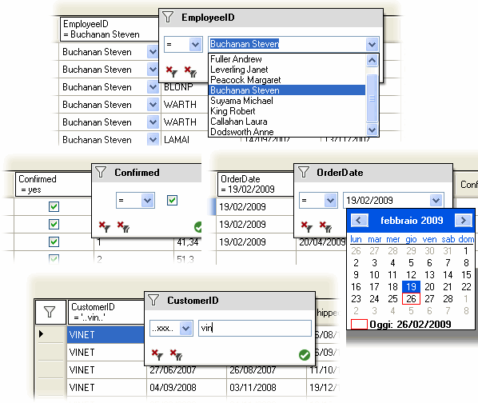

## Introduction
I was looking for an easy and flexible grid filtering mechanism to use with new and old applications. I've found no preexisting solutions that fully satisfy my needs. So, I decided to make my own filtering library. The goals I've tried to reach are:

* Easy to integrate: Availability of a "few lines of code" usage to satisfy the needs of rapid integration.
* User Friendly: Nice to look, easy to use.
* Not code pervasive: Using a DataGridView derivation would constrain people to re-declare their instances. Moreover, this could be in conflict with existing grid derivations.
* Flexible: There are never enough filters in the world!

## Using the Code
This is for eager people. The promised "few lines of code" are just one. Add the DgvFilterPopup.dll to your references. Write somewhere a line like this:

    DgvFilterManager filterManager = new DgvFilterManager(dataGridView1);

That's all. Your grid is now able to filter the column values. Right-click on the column headers to see a popup with different filtering features, based on the clicked column data type.

**Note:** Your grid must be data-bound to a `DataView`, `DataTable`, or a `BindingSource` resolving to one of these two.

## Class Architecture
The three main classes are exposed in the following diagram:

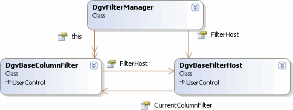

### The DgvFilterManager Class
The `DgvFilterManager` class doesn't provide a user interface. Its work is to coordinate the interaction between the `DataGridView` and the visual filtering elements. When you assign a `DataGridView` to a `DgvFilterManager`, the latter attaches some handlers to respond to right click on column headers and to perform some custom painting on the grid. When the user right clicks a column header, the `DgvFilterManager` shows a popup near the column. This popup is a control that serves as a host for other controls, one for each column. Only one of these child controls is visible at a time, based on the clicked column. We have one filter host control and many column filter child controls.

The *filter host* control must be a derivation of the `DgvBaseFilterHost` class, while filter controls must be derived from the `DgvBaseColumnFilter` class. These two classes don't provide any user interface themselves.

As a default, the `DgvFilterManager` uses a standard host implementation, named `DgvFilterHost`, and depending on each column type and data type, one of the filter standard implementations (see below): `DgvTextBoxColumnFilter`, `DgvCheckBoxColumnFilter`, `DgvComboBoxColumnFilter` or `DgvDateColumnFilter`.

When a `DataGridView` is attached to the manager, the latter performs the following actions:

* It creates a *filter host* that is an instance of the DgvFilterHost class. If you have already provided a filter host, this step is skipped.
* It creates a list of `DgvBaseColumnFilters`, one per column, and initializes each element to a specialization of `DgvBaseColumnFilter`. If `AutoCreateFilters` is false, this step is skipped.
You can force a specific *column filter* type for a certain column, intervening in this process through the `ColumnFilterAdding` event. You can also intervene, after the auto-creation process, accessing the filter instances through one of the two indexers provided by the manager, and replacing them with user-chosen instances.

### The DgvBaseFilterHost Class
The purpose of the *filter host* control is to show a popup near a right-clicked column and to host child *column filter* controls. When the popup is shown, only the *column filter* control related to the right-clicked column is visible. `DgvBaseFilterHost` is a derivation of `UserControl`, and provides functionalities to cooperate with `DgvFilterManager`.

**Note:** This class is intended as an `abstract` class. However, declaring it as abstract would generate errors within the designer when designing derived classes.

In your derivation, you have to provide a host area (such as a panel) and override the `FilterClientArea` to return it. Also, create visual elements for *remove filter, remove all filters, apply filter*, and use the `DgvFilterManager` methods `ActivateFilter` and `ActivateAllFilters` to make them alive.

### The DgvBaseColumnFilter Class
The purpose of a *column filter* control is to contain visual elements, allowing the end user to construct a filter. When inheriting from it, you can work just like creating any other user control. This class is a derivation of `UserControl`, and provides functionalities to cooperate with `DgvFilterManager`.

**Note:** This class is intended as an `abstract` class. However, declaring it as abstract would generate errors within the designer when designing derived classes.

You should override `OnFilterExpressionBuilding` to provide a filter expression construction logic and to set the values of the `FilterExpression` and `FilterCaption` properties.

## Standard Implementations
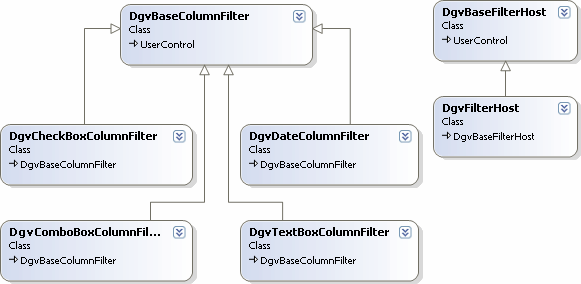

### The DgvFilterHost Class
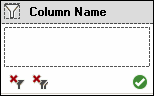

This is the standard implementation of `DgvBaseFilterHost`. This class does nothing special. Most of the logic is in its base class. It just contains visual elements such as buttons and graphics, and a panel acting as the client area for child *column filter* controls.

### The DgvTextBoxColumnFilter Class
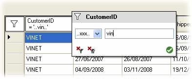

This is one of the `DgvBaseColumnFilter` standard implementations. It's composed of a combobox containing a list of operators and a textbox in which to type the value of the filter. This *column filter* is used by default with DataGridViewTextBoxColumns, except when the bound data type is `DateTime`. The list of available operators is different between string types and numeric types.

### The DgvTextBoxColumnFilter Class
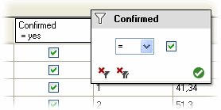

A standard implementation for the filtering of checkbox columns. The only available operators are the equal and the general *null* and *not null* operators.

### The DgvDateColumnFilter Class
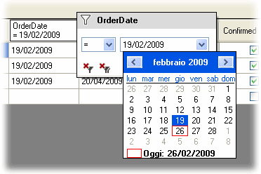

A standard implementation for the filtering of date columns.

### The DgvComboBoxColumnFilter Class
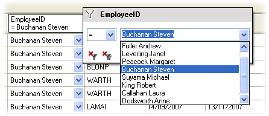

A standard implementation for the filtering of combobox columns. By default, on textbox columns, the filter manager uses `DgvTextBoxColumnFilter` instances. However, you can force an instance of `DgvComboBoxColumnFilter` on such columns. In this case, the `DgvComboBoxColumnFilter` instance automatically creates a distinct list of values from the column data. You should do an explicit call to the `RefreshValues()` method when the underlying data changes.

## Customizing
If *"one line usage"* is not sufficient for your needs, you can control the process of adding and showing filters in different ways.

### Using a DgvComboBoxColumnFilter for Non-Combobox Columns
Use one of the manager indexers to access the filter, and assign it an instance of the `DgvComboBoxColumnFilter` class.

    DgvFilterManager fm = new DgvFilterManager(dataGridView1);
    fm["CustomerID"] = new DgvComboBoxColumnFilter();

### Using Events
#### ColumnFilterAdding
Using this manager event, you may force your preferred filter before the manager creates the predefined filter. The event is raised for each column in the grid when you set the `DataGridView` property.

    ...
    DgvFilterManager fm = new DgvFilterManager();
    fm.ColumnFilterAdding += new ColumnFilterEventHandler(fm_ColumnFilterAdding);
    fm.DataGridView = dataGridView1; // this raises ColumnFilterAdding events
    ...
    
    void fm_ColumnFilterAdding(object sender, ColumnFilterEventArgs e) {
      if (e.Column.Name == "CustomerID") {
        e.ColumnFilter = new DgvComboBoxColumnFilter();
      }
    }

#### PopupShowing
This manager event allows you to customize the filter host position when popped up.

    ...
    DgvFilterManager fm = new DgvFilterManager();
    fm.DataGridView = dataGridView1;
    // Customize the popup positioning.
    fm.PopupShowing += new ColumnFilterEventHandler(fm_PopupShowing);
    ...
    
    void fm_PopupShowing(object sender, ColumnFilterEventArgs e) {
      DgvFilterManager fm = ((DgvFilterManager)sender);
      Rectangle HeaderRectangle = 
        fm.DataGridView.GetCellDisplayRectangle(e.Column.Index,-1,true);
      //Show the popup under the column header
      fm.FilterHost.Popup.Show(fm.DataGridView, HeaderRectangle.Left, HeaderRectangle.Bottom);
      e.Handled = true;
    }

#### FilterExpressionBuilding
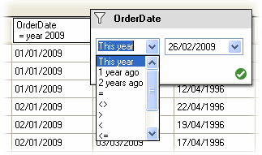

Using the `DgvBaseColumnFilter` event, you can customize the filter expression building process. In the following code example, we add new operators and then manage them in the event handler. The `FilterExpression` and `FilterCaption` properties will be used by the manager to build the whole filter and to set the column caption.

    ...
    DgvDateColumnFilter OrderDate;
    ...
    DgvFilterManager fm = new DgvFilterManager(dataGridView1);
    fm.DataGridView = dataGridView1; //after this line, column filters are created
    
    // Get the created column filter for OrderDate column
    OrderDate = ((DgvDateColumnFilter)fm["OrderDate"]);
    
    //Add some new operators
    OrderDate.ComboBoxOperator.Items.Insert(0, "This year");
    OrderDate.ComboBoxOperator.Items.Insert(1, "1 year ago");
    OrderDate.ComboBoxOperator.Items.Insert(2, "2 years ago");
    
    //Add an handler
    OrderDate.FilterExpressionBuilding += 
    new CancelEventHandler(OrderDate_FilterExpressionBuilding);
    ...
  
    void OrderDate_FilterExpressionBuilding(object sender, CancelEventArgs e) {
      int index = OrderDate.ComboBoxOperator.SelectedIndex;
      if (index < 3) { // the first 3 are the new operators
        int year = (DateTime.Today.Year - index);
        OrderDate.FilterExpression = "(OrderDate>='" + year.ToString() + "-1-1' " 
                               + "AND OrderDate<='" + year.ToString() + "-12-31') ";
        OrderDate.FilterCaption = OrderDate.OriginalDataGridViewColumnHeaderText 
                            + "\n = year " + year.ToString();
        e.Cancel = true;
      }
    }

### Subclassing
A more powerful way to customize your filters is through subclassing. You should think of the proposed standard implementations of `DgvBaseFilterHost` and `DgvBaseColumnFilter` as just some possible implementations.

#### Creating Your Own Host
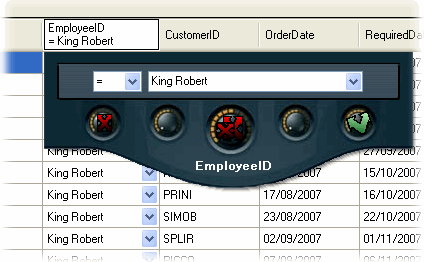

As said above, derive from `DgvBaseFilterHost` and provide some visual elements. Add a container within your control to host the child filter controls, and return it by an override of the `FilterClientArea` property. The base class provides the necessary logic to cooperate with the manager, and provides some facilities helping to position the child filter controls and to adjust the host size. Another facility simplifies the creation of transparent skinned hosts, thanks to the method `BitmapToRegion` I've found in a very nice article by John O'Byrne.

**Note:** A skinned host must be constrained to a fixed size. Be sure to inhibit the resize logic by overriding the `DoAutoFit` method. Also, keep in mind this limitation when designing your own host and your filters.

    DgvFilterManager fm = new DgvFilterManager();
    fm.FilterHost = new CustomizedFilterHost();
    fm.DataGridView = dataGridView1;

#### Creating Your Own Column Filters
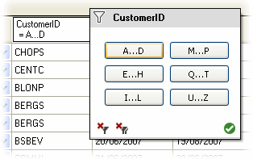

Creating new column filters is simple. Derive from `DgvBaseColumnFilter` and add your visual elements. Override `OnFilterExpressionBuilding` to provide filter building logic and, using `DataView.RowFilter` rules, assign a value to the `FilterExpression` property and a title to the `FilterCaption` property.

Remember that the filter is applied when the user clicks on the *OK* button of the host. However, you can obtain an immediate filter application doing a call to the `RebuildFilter` method of the filter manager.

## New Filters
To satisfy some requests, in the 1.1.0.0 update, I've introduced three new filter implementations:

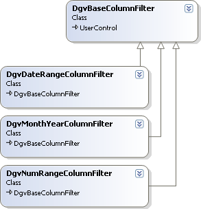

### The DgvMonthYearColumnFilter Class
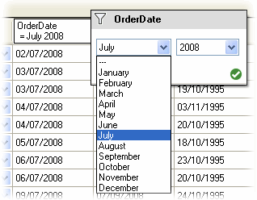

This filter allows the user to select a month and a year. By setting the `YearMin` and `YearMax` properties, you can control the shown years range. Month names default to English, but you may provide culture-specific names by once setting the value of the static property `MonthCsvList` with a comma separated list of month names.

### The DgvNumRangeColumnFilter Class
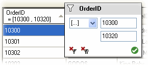

Use this filter to allow the user to specify a range filter on numeric columns.

### The DgvDateRangeColumnFilter Class
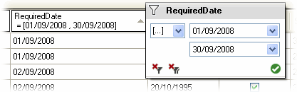

Use this filter to allow the user to specify a range filter on date columns.

## Conclusions
In this article, I've exposed the class architecture and common usage scenarios. This conceptual overview, I hope, will help you understand how it works. For detailed explanations and references, you can see the attached documentation.

**Note:** To those interested in documenting their works, I've used these materials:

* [XML Documentation Comments](http://msdn.microsoft.com/en-us/library/b2s063f7(VS.80).aspx) from MSDN
* [Sandcastle v2.4.10520](http://www.microsoft.com/downloads/details.aspx?FamilyID=E82EA71D-DA89-42EE-A715-696E3A4873B2&displaylang=en): A documentation command-line compiler from Microsoft
* [Help File Builder 1.8.0.1 Beta](http://shfb.codeplex.com/Release/ProjectReleases.aspx?ReleaseId=18639): A Sandcastle GUI (requires .NET 3.5) from Eric Woodruff
